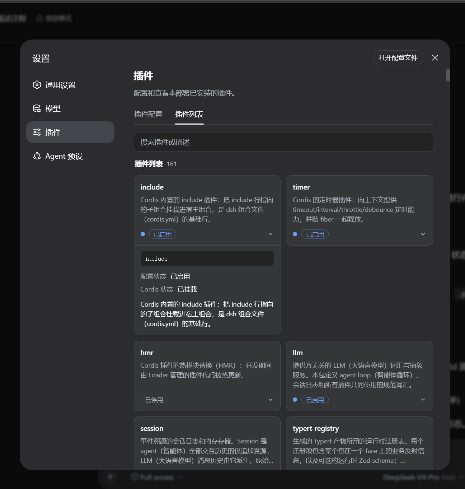

# DSH Plugin Description Extension

English | [中文](README.md)

Lost in the sea of content-free plugins on the DSH plugin page? This plugin adds a
self-description to every one of them, so you can easily pick the plugins you actually need.

A **persistent composition plugin** for **DeepSeek Harness (DSH)**: mount one row in the
composition and every plugin card on the Web Settings **plugin list** page gets a bilingual
(zh/en) **description**; it also publishes the `pluginDescriptions` service so other plugins
can register their own descriptions.



| File/Directory                           | Description                                                                                                    |
| ---------------------------------------- | -------------------------------------------------------------------------------------------------------------- |
| `src/index.js`                          | Host half source: provides the `pluginDescriptions` service + the `GET /plugin-descriptions` data endpoint      |
| `src/client.js`                         | Client half source (`window.__ModuleLoader__` factory): renders the annotated plugin card list                  |
| `lib/`                                  | Build output (committed): `index.js` is the `exports["."]` target (dictionary inlined), `client.js` is the `exports["./client"]` target |
| `descriptions/plugin-descriptions.json` | Built-in description dictionary (module name → `{ zh, en }`), covering all 134 module names of the shipped DSH composition |
| `scripts/build.mjs`                     | Build: `src` + dictionary → `lib/`, `dist/package/`; `--verify` runs full validation (CI)                      |
| `scripts/regenerate-descriptions.mjs`   | Dictionary regenerator: re-extracts the dictionary from the package READMEs of a DSH checkout                   |
| `cordis.patch.yml`                      | Bundle patch: applied automatically after `dsh plugin add`, inserts the composition row (host row + browser roster) |
| `dist/`                                 | Build artifacts (not committed; generated by CI: tgz, installable package directory)                            |

## Features

- **Persistent**: one composition row enters both the host composition (Node half) and the
  browser plugin roster (Client half); mounted automatically on every DSH boot, effective
  across sessions, no in-session action needed.
- **Per-card descriptions**: every card on the plugin list page shows a bilingual description;
  expanding a card reveals the full description, the Loader entry id, the configuration
  status, and the Cordis mount status.
- **Upgraded search**: the search box matches plugin names, entry ids, and description text
  at the same time; the language follows the UI language (zh/en) automatically.
- **Extensible**: the built-in dictionary of 134 module names is only the default; any plugin
  can register/override descriptions through the `pluginDescriptions` service, with priority
  over the built-in dictionary.

## Installation (CLI, persistent)

Requirements: a working DeepSeek Harness Web profile (pnpm required; `dsh plugin` depends on it).

This plugin is a **dual-face npm package** declaring `dsh.bundle`: after `dsh plugin add`,
the plugin manager appends it to `dsh.profile.bundles` and applies the bundled
`cordis.patch.yml` at boot to insert the composition row automatically (host row + browser
roster) — no manual composition edits.

### Install from GitHub Release (recommended)

```sh
dsh plugin --profile web add \
  https://github.com/<your-username>/plugin-description/releases/download/v1.1.1/dsh-plugin-description-1.1.1.tgz
```

You can also install a pinned Git tag directly (no build needed — the repo commits the `lib/`
build output, so no scripts run during install):

```sh
dsh plugin --profile web add github:<your-username>/plugin-description#v1.1.1
```

Restart after installing:

```sh
dsh web
```

> If pnpm reports `ERR_PNPM_ADDING_TO_ROOT`, add `ignore-workspace-root-check=true` to the
> `.npmrc` in the profile directory and retry.

### Verify

```sh
dsh web --dump-config | grep -n "plugin-description"
```

`plugin-description` in the output, plus a description on every card under
Settings → Plugins → Plugin list, means it is loaded.

### Upgrade and uninstall

```sh
# Upgrade to a specific version (or tag)
dsh plugin --profile web add github:<your-username>/plugin-description#v1.1.2

# Uninstall (removes the dependency and the bundle layer; composition files untouched)
dsh plugin --profile web remove dsh-plugin-description
```

Then restart `dsh web`.

### Local development (editing the repo source)

```sh
# POSIX: link this repo; rebuild + restart to take effect
dsh plugin --profile web add link:$(pwd)

# Windows (pnpm 8 has parsing issues with drive-letter link:/file: specs): pack a tgz and install it
npm run build && npm pack --pack-destination dist
dsh plugin --profile web add .\dist\dsh-plugin-description-<version>.tgz
```

### Manual install (without the CLI)

1. Download the `dsh-plugin-description-v<version>.zip` release asset and place the extracted
   package directory at `<DSH_HOME>/profiles/node_modules/dsh-plugin-description/`;
2. Add one row to the profile's `cordis.patch.yml` (same content as this repo's root
   `cordis.patch.yml`);
3. Restart DSH.

## Customizing & adding descriptions (ordinary users)

No code, no repackaging — edit right on the page:

1. Under Settings → Plugins → Plugin list, expand any plugin card and click **Edit description**;
2. Fill in the Chinese/English descriptions and click **Save**. By default all cards with
   the same name change together (keyed by plugin); check "Only change this card" to change
   just this card and leave other same-named cards untouched — useful when one plugin is
   loaded several times for different purposes;
3. Customized cards carry a **"Customized"** badge; in edit mode, **Restore default** returns
   to the built-in description.

Changes are persisted to the user dictionary file
**`<DSH_HOME>/plugin-descriptions.json`** (next to settings.yaml), surviving upgrades and
reinstalls. You can also edit it with any text editor — reopen the page and it takes effect:

```json
{
  "modules": { "@your-scope/your-plugin": { "zh": "中文说明", "en": "English description" } },
  "entries": { "your-row-id": { "zh": "只改这一张卡片的说明" } }
}
```

Final precedence: **user dictionary > plugin runtime registrations > built-in special entries
> built-in dictionary**. For safety, write access from the UI is limited to loopback
requests — the same constraint as the DSH settings API.

## Integration: let other plugins register their own descriptions

The plugin's Host half publishes the **`pluginDescriptions`** service in the host
composition; any Host-side plugin (composition row) in the same DSH process can integrate
like this:

```js
return {
  apply(ctx) {
    const descriptions = ctx.get('pluginDescriptions')   // optional read, must null-check
    if (descriptions === undefined) return
    ctx.effect(() => descriptions.register([
      // Register by module name (all Loader entries of that module share this description)
      { moduleName: '@your-scope/your-plugin', zh: '你的插件的中文说明。', en: 'English description.' },
      // Register by Loader entry id (scoped to one composition row; wins over moduleName)
      { entryId: 'your-row-id', zh: '针对特定条目 id 的说明。' },
    ]))
  },
}
```

Contract details:

- `register(entries)` accepts an array of `{ moduleName?, entryId?, zh, en? }` and returns a
  **disposer** that withdraws exactly the registered entries; put it in `ctx.effect` so it is
  cleaned up with the plugin fiber.
- `resolve(moduleName, entryId)` looks up the registry in `entryId` → `moduleName` order.
- Final display precedence: **user dictionary > runtime registry > built-in special entries
  (codex/claude-code) > built-in dictionary**.
- As a hard dependency you can also declare `inject: ['pluginDescriptions']`; Cordis parks the
  plugin until the service appears.
- This plugin dogfoods its own service: in `apply` it registers its own
  (`dsh-plugin-description`) description through the same service — that is how the card in
  the plugin list gets its text (the built-in dictionary also contains the entry, as a double
  safety).

### Merging descriptions into the repo (for everyone; open to plugin authors only)

1. Edit `descriptions/plugin-descriptions.json` directly and add
   `"<moduleName>": { "zh": "...", "en": "..." }`.
2. Or run the regenerator: prepare a DSH checkout and run
   `node scripts/regenerate-descriptions.mjs <checkout-path>`; it extracts the first paragraph
   from each package README and reapplies the curated `OVERRIDES` table in
   `scripts/regenerate-descriptions.mjs`.
3. Run `npm run build`, then submit a PR.

## Build & release

```bash
npm run build           # src + dictionary → lib/{index,client}.js, dist/package/
npm run verify          # build + full validation (dictionary integrity, module id, exports contract; CI)
```

## FAQ

**Blank page or boot failure in the browser?** The client kernel requires every roster plugin
to reach ACTIVE; this plugin only does optional service reads (`ctx.get` with undefined
checks) and has no hard injected dependencies, so it cannot block boot. If it does happen,
add `disabled: true` to the composition row to rule it out.

**Want to change a description?** Three ways: click "Edit description" on the page (effective
immediately — the first choice for ordinary users); override at runtime with
`pluginDescriptions.register` (for plugin authors); or edit
`descriptions/plugin-descriptions.json`, run `npm run build`, and update the package in the
profile (effective for everyone).

**Where do the official plugins' descriptions come from?** The built-in dictionary is
extracted from the first paragraphs of the DeepSeek Harness package READMEs and manually
curated; a few entries (id-level, such as the codex/claude-code backends) have dedicated
descriptions.

## License

[MIT](./LICENSE)
